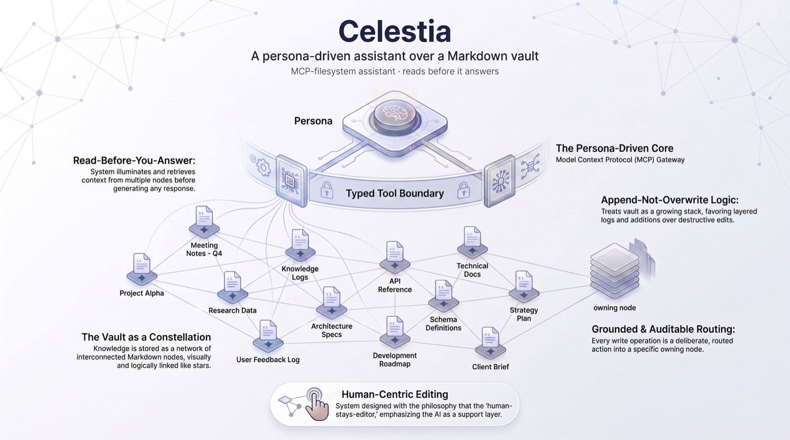
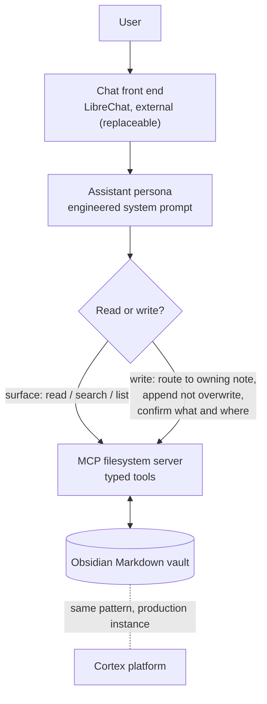

# Celestia

A persona-driven AI assistant over an Obsidian knowledge vault, wired through a typed MCP filesystem core.

**[▶ Watch the demos](#demos)** · three short clips, one capability each, recorded live against the demo vault.

---

## What it is

Celestia is an assistant that reads, searches, and writes a Markdown knowledge vault as its working memory. Ask it to brief you on your day, prep you for a meeting, or file an update, and it opens the relevant notes first, reasons over what it found, and only then answers. When it writes, it routes the change to the note that owns that piece of truth, appends rather than overwrites, and tells you exactly what it touched.

The durable engineering here is the vault, the persona, and the tool layer between them. The chat window is an off-the-shelf open-source front end that exists to make the demo look like a product; it is deliberately replaceable and lives outside this repo. Underneath Celestia sits [Cortex](https://github.com/janvrsinsky/jv-cortex-platform), the self-hosted knowledge platform this pattern was built for.

## What is real, and what is sanitized

Being precise about this, because trust starts here.

**Real:** the architecture, and the system behind it. The MCP-filesystem-over-a-Markdown-vault pattern, the persona design, the note-ownership routing, and the write discipline are the actual engineering. The same system runs in my daily production over my own vault; this repo is a sanitized demo of it, so the design is on display without exposing the private vault it normally works against.

**Sanitized:** everything on screen. The clips run against a throwaway demo vault populated with a fictional company (a family-run machining shop) and fictional people. No real personal notes, values, health, finance, or private content appears anywhere. The vault content is fabricated for the demo; the machinery around it is not.

## Demos

Three short clips, one capability each, recorded live against the demo vault.

https://github.com/user-attachments/assets/5e982028-5579-4712-a8c9-d2e243e3a143

**What to watch:** one request fans out into several reads across the vault (dashboard, inbox, project tasks) before a single word is written, and comes back as a short brief built around the few decisions that actually matter today, not a dump of everything.

https://github.com/user-attachments/assets/3319654e-62ce-4698-80af-49d5a247b643

**What to watch:** a spoken-style business update gets written into the project note that owns it, appended to the log rather than overwriting anything, and the assistant reports back the exact file it changed and what it recorded.

https://github.com/user-attachments/assets/630a1abe-99a8-42a3-abe5-52d687f4f2da

**What to watch:** asked to prep for a meeting, it pulls the meeting note and the surrounding context and briefs the people dynamics in the room, not just the agenda facts, while keeping sensitive threads out of anything meant for other eyes.

## How it works

The system is a small set of deliberate design decisions, not a framework.

- **The vault is the product; the chat UI is not.** In the recorded demo the chat UI is an off-the-shelf open-source front end (LibreChat), which is external and not part of this repo. It is disposable by design: swap it for any MCP-speaking client or a custom web front end and nothing underneath changes, because the assistant's real interface is the tool layer, not the window.
- **The agent gets typed tools, not raw access.** A Model Context Protocol filesystem server exposes a narrow set of operations over the vault: `read_file`, `write_file`, `list_directory`, `search_files`, `directory_tree`. Every read and every write goes through that boundary, which keeps what the agent does observable and constrained. This is retrieval over a live Markdown filesystem, not a vector database.
- **Note-ownership routing.** Each piece of truth has an owning note: a business update belongs to its project card, an ongoing responsibility to its area note, a raw capture to the inbox. The assistant decides ownership before it writes, so state lands where it can be found again instead of in a scratchpad.
- **Append, do not overwrite.** Reads surface; writes append to a log section rather than replacing prior content. History is preserved and every change is reconstructable.
- **The persona is an engineered artifact.** Voice, working modes (brief me, prep me, file this), time anchoring, and discretion rules (sensitive threads never leak into shared documents) are specified in the system prompt, so behavior is repeatable rather than a matter of mood.
- **The human stays the editor.** New content lands in the inbox first, nothing is ever deleted, and after any write the assistant confirms what changed and where in one line. Automation proposes and records; the person decides and purges.

Celestia is one instance of a pattern reused across several systems: a persona, plus a typed MCP tool layer, plus a routing or policy boundary written in code, on a disposable chat front end. Its siblings put the same shape over accounting data, a podcast archive, and a live trading fleet. See the [portfolio index](https://github.com/janvrsinsky) for the others.

## Stack

In this repo:

- **MCP filesystem server** (`mcp_server.py`) over an Obsidian Markdown vault, exposing the five typed read / write / list / search / tree tools behind one sandbox guard.
- **Note-ownership and append-vs-surface routing** (`routing.py`) as the write discipline in front of the tools.
- **Persona and system-prompt design** (`persona/`) carrying voice, modes, time anchoring, and discretion rules.
- **A throwaway demo vault** (`demo_vault/`) of fictional content, plus a standard-library self-test (`test_flow.py`).

External (not included here):

- **Anthropic Claude API** as the model behind the assistant.
- **An off-the-shelf chat front end** (LibreChat) as the disposable product surface used to record the demo. Any MCP-speaking client works; the face is not what this repo ships.

## Correctness: grounded and auditable

This system's guarantee is not a retrieval score, and it would be dishonest to dress it up as one. Celestia is trustworthy because it is grounded and auditable:

- It reads live vault state before answering, so replies reflect what is actually on disk rather than a guess.
- Writes are explicit and reversible: appended, never overwritten, and reported back file-by-file, so there is always a clear record of what the assistant changed.
- Ownership routing means a written fact can be found where it belongs, which is what makes the state honest over time.

Where correctness does reduce to a measurable retrieval problem, the rigor lives in the sibling that can carry it: the podcast-archive assistant ships a hand-labeled gold set with recall@k and MRR numbers across keyword, dense, and hybrid retrieval. Celestia's job is different: its guarantee is grounded, auditable state that reflects what is actually on disk, not a retrieval score.

## How it's built

The architecture, the tool boundary, the routing rules, and the persona spec are mine; the code was produced by directing AI tooling (primarily Claude Code) and then read, run, and reviewed before anything shipped.

## Status and contact

**Tier: In daily production.** The system runs in my daily production over my own vault; this public repo is a sanitized cut of it, recorded against a throwaway demo vault. The platform it sits on is [jv-cortex-platform](https://github.com/janvrsinsky/jv-cortex-platform).

- Portfolio: [github.com/janvrsinsky](https://github.com/janvrsinsky)
- LinkedIn: [linkedin.com/in/janvrsinsky](https://linkedin.com/in/janvrsinsky)
