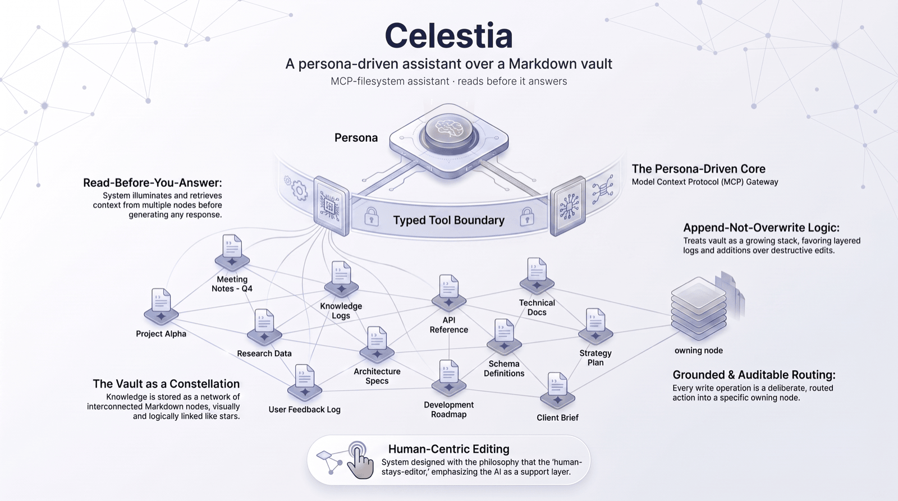
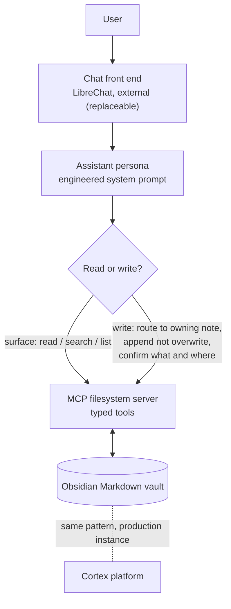

# Celestia

A persona-driven AI assistant over an Obsidian knowledge vault, wired through a typed MCP filesystem core.

**Portfolio exhibit.** This is a sanitized public extract of a private system in daily use. The architecture and method are real; the data and identifiers are stand-ins, and the section "What is real, and what is sanitized" below lists which is which.

[](https://github.com/janvrsinsky/jv-obsidian-assistant/actions/workflows/ci.yml)

**[▶ Watch the demos](#demos)** · three short clips, one capability each, recorded live against the demo vault.

## What it does

Celestia reads, searches, and writes a Markdown knowledge vault as its working memory. Ask it to brief you on your day, prep you for a meeting, or file an update: it opens the relevant notes first, reasons over what it found, and then answers. When it writes, it routes the change to the note that owns that piece of truth, appends to a log section, and reports exactly what it touched.

## What is real, and what is sanitized

**Real:** the MCP-filesystem-over-a-Markdown-vault pattern, the persona design, the note-ownership routing, and the write discipline are the actual engineering. The same system runs in my daily production over my own vault; this repo is a sanitized demo of that design.

**Sanitized:** everything on screen. The clips run against a throwaway demo vault populated with a fictional company (a family-run machining shop) and fictional people. No real personal notes, values, health, finance, or private content appears anywhere.

## Demos

https://github.com/user-attachments/assets/5e982028-5579-4712-a8c9-d2e243e3a143

**What to watch:** one request fans out into several reads across the vault (dashboard, inbox, project tasks) before a single word is written, then returns a short brief built around today's few real decisions.

https://github.com/user-attachments/assets/3319654e-62ce-4698-80af-49d5a247b643

**What to watch:** a spoken-style business update is appended to the log of the project note that owns it, prior content intact, and the assistant reports the exact file it changed and what it recorded.

https://github.com/user-attachments/assets/630a1abe-99a8-42a3-abe5-52d687f4f2da

**What to watch:** meeting prep pulls the meeting note and surrounding context, briefs the people dynamics in the room along with the agenda facts, and keeps sensitive threads out of anything meant for other eyes.

## How it works

- **Typed tools only.** A Model Context Protocol filesystem server exposes five operations over the vault: `read_file`, `write_file`, `list_directory`, `search_files`, `directory_tree`, all behind a single sandbox guard, so what the agent does stays observable and constrained. Retrieval runs over the live Markdown filesystem; there is no vector database.
- **Note-ownership routing.** Each piece of truth has an owning note: a business update belongs to its project card, a responsibility to its area note, a raw capture to the inbox. The assistant decides ownership before it writes, so state lands where it can be found again.
- **Append, never overwrite.** Writes append to a log section; history is preserved and every change is reconstructable.
- **Engineered persona.** Voice, working modes (brief me, prep me, file this), time anchoring, and discretion rules (sensitive threads never leak into shared documents) live in the system prompt, so behavior is repeatable.
- **The human stays the editor.** New content lands in the inbox first, nothing is ever deleted, and after any write the assistant confirms what changed and where in one line.
- **Replaceable front end.** The chat window in the clips is LibreChat, an off-the-shelf open-source client that lives outside this repo. Any MCP-speaking client works; the assistant's real interface is the tool layer.


```mermaid
flowchart TB
    U["User"] --> FACE["Chat front end<br/>LibreChat, external (replaceable)"]
    FACE --> AG["Assistant persona<br/>engineered system prompt"]
    AG --> R{"Read or write?"}
    R -->|"surface: read / search / list"| MCP["MCP filesystem server<br/>typed tools"]
    R -->|"write: route to owning note,<br/>append not overwrite,<br/>confirm what and where"| MCP
    MCP <--> V[("Obsidian Markdown vault")]
    V -. "same pattern, production instance" .- CX["Cortex platform"]
```

The same pattern (persona, typed MCP tool layer, routing boundary in code, disposable chat front end) recurs across my [portfolio](https://github.com/janvrsinsky): siblings put it over accounting data, a podcast archive, and a live trading fleet. Underneath sits [Cortex](https://github.com/janvrsinsky/jv-cortex-platform), the self-hosted knowledge platform it was built for.

## In this repo

- `mcp_server.py`: the MCP filesystem server and its sandbox guard.
- `routing.py`: note-ownership and append-vs-surface routing, the write discipline in front of the tools.
- `persona/`: system-prompt design carrying voice, modes, time anchoring, and discretion rules.
- `demo_vault/`: the throwaway demo vault of fictional content.
- `test_flow.py`: standard-library self-test, run by GitHub Actions on every push.

The LLM API behind the assistant and the chat front end are external; neither ships in this repo.

## Run it

```sh
python test_flow.py                                # self-test, standard library only
pip install -r requirements.txt
CELESTIA_VAULT=./demo_vault python mcp_server.py   # run as an MCP server
```

The self-test verifies three claims this README makes, against a throwaway copy of the demo vault: routing into the owning note's `## Log` section, append semantics with every prior log line intact, and the sandbox guard blocking directory-traversal and absolute-path escapes.

## Correctness

Celestia's guarantee is grounded, auditable state: it reads live vault state before answering, so replies reflect what is actually on disk, and writes are explicit and reversible, appended and reported back file by file. Where correctness reduces to a measurable retrieval problem, the rigor lives in the sibling built for it: the podcast-archive assistant ships a hand-labeled gold set with recall@k and MRR numbers across keyword, dense, and hybrid retrieval.

## Status and contact

**PRODUCTION EXTRACT.** A sanitized public cut of a private system in real use. The architecture and method are real; data, names and some components are stand-ins, and the README lists which is which.

- Portfolio: [github.com/janvrsinsky](https://github.com/janvrsinsky)
- LinkedIn: [linkedin.com/in/janvrsinsky](https://linkedin.com/in/janvrsinsky)

## Topics


